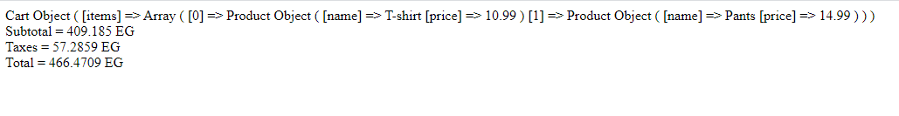
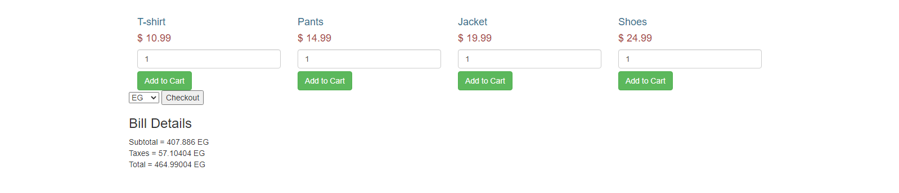

#BE ( Task ) 
##Problem solution:
- follow most of SOLID princibles such as: Single responsibility and open-closed princible in order to produce an organized, clear and clean code.
- use the Strategy design pattern to give the user a space to choose the type of bill during the runtime.

## First Scenario ex:

## Second Scenario ex:

