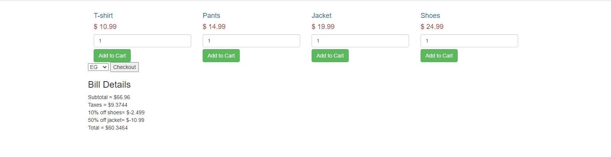

# Problem Solution:
- follow most of SOLID princibles such as: 
      Single responsibility and open-closed princible in order to produce an organized, clear and clean code.
- use the Strategy design pattern to give the user a space to choose the type of bill during the runtime.

## How program run:
   1- you should determine the amount of each product that you need. then click on add product button.
   2- select the bill currency that you want to proceed then click on checkout button.

### First Scenario:

### Second Scenario:

